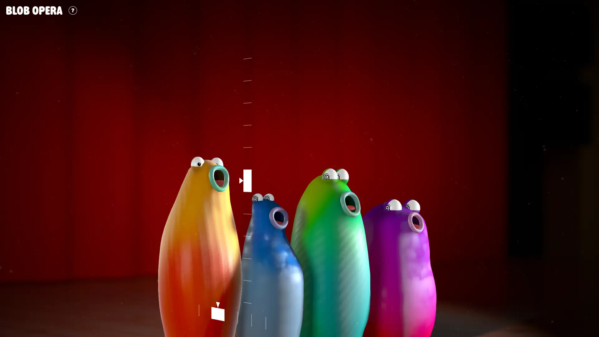
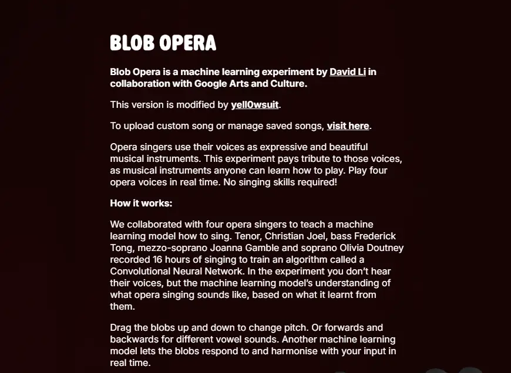
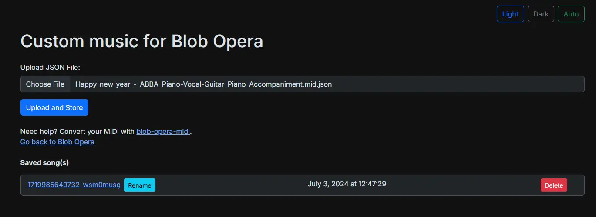

# Blob Opera: Enhanced Edition

Create your own ML-powered opera song! Created by David Li with Google Arts & Culture, with modifications by yell0wsuit.

## Changes from the original version

- Tutorial skip can now be remembered, without having to do the tutorial again after a refresh.
- Use the Inter font for legibility.
- Tweak scripts to fetch resources (fonts, styles, data, etc.) from first-party instead of resorting to third-party servers.
  - This allows offline use.
- Add custom song upload and management (use ``customsong.html``). No need for <kbd>F12</kbd> or DevTools, just upload the song in JSON format[^1], and the link is generated for you to use.
  - This won't upload to Google's server, but you can share the JSON anyway :)

[^1]: The JSON format must be specific to Blob Opera. Use tools such as [blob-opera-mini](https://github.com/OverlappingElvis/blob-opera-midi) to convert MIDI to Blob Opera format.

## Play

- Online version: <https://yell0wsuit.github.io/blob-opera-enhanced/>
- Offline version: <https://github.com/yell0wsuit/blob-opera-enhanced/releases/latest>
  - Choose the correct version to your operating system in the "Assets" section.  
    For Windows, look for ``win32-x64`` with <kbd>Ctrl</kbd>+<kbd>F</kbd>.

## Screenshots

